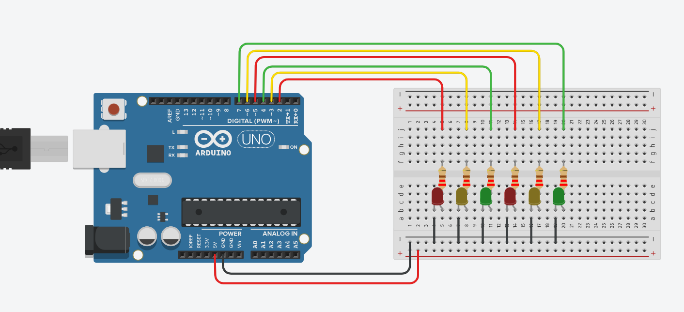

# IoT_TrafficManagement

Arduino UNO is a general-purpose development board that is based on the ATmega328P microcontroller board and supports 14 Digital I/O pins. The traffic light controller logic can be implemented using LEDs interfaced with Arduino UNO through the 14 Digital pinouts. The Integrated Development Environment (IDE) is used to compile and execute program codes written in C or C++. 
Arduino board’s design use a variety of microprocessors and controllers. It is equipped with sets of digital and analog input/output (I/O) pins that may be interfaced to various expansion boards or breadboards (shields) and other circuits. The boards feature serial communications interfaces, including Universal Serial Bus (USB) on some models, which are also used for loading programs from personal computers. The microcontrollers are typically programmed using the features from the programming languages C and C++. 

We simulated the traffic light controller system for simple two-way intersection and for a two-way intersection with traffic sensors, using the Arduino UNO R3 controller in TinkerCAD. We also wrote the C code that was used to control the traffic flow.

1.	Connect the circuit using breadboard according to the schematic 
 
2.	Load the below C program for simulating a normal traffic light controller on Arduino UNO using the Arduino IDE. 
